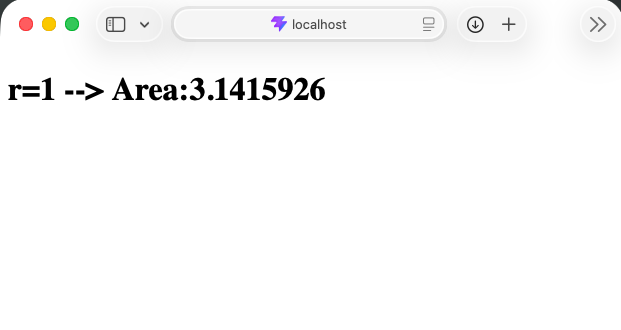

## Problem

```sh
deno run -A npm:create-vite@latest
# add our custom area calculator to deno.jsonc and edit src/main.ts to test it.
deno install
deno run dev
```

and we get 

```
Failed to resolve import "@CoolMath/circleArea" from "src/main.ts". Does the file exist?
```

So naturally, we install **deno-vite-plugin**.

```sh
deno install npm:@deno/vite-plugin 
touch vite.config.ts
```

```ts
// vite.config.ts
import { defineConfig } from "vite";
import deno from "@deno/vite-plugin";
export default defineConfig({
  plugins: [
    deno()
  ],
});
```

```sh
# let's try again
deno run dev
```

Unfortunately, it is still upset!

```
Failed to resolve import "@MyMath/computePi" from 
"deno::TypeScript::file:/[redacted]/math-workspace/circleArea/mod.ts::/[redacted]/math-workspace/circleArea/mod.ts". 
Does the file exist?

../math-workspace/circleArea/mod.ts:1:19
1  |  import { pi } from "@MyMath/computePi";
   |                      ^
2  |  export function area(radius) {
3  |    return pi() * radius * radius;
```

Right.

## The fix:

it turns out, `@deno/loader` can handle the situation.

we just need to modify the vite-plugin to allow resolution.

```
current importer
  ↓
determine which deno.json / workspace owns that importer
  ↓
get/create loader for that config + Vite environment
  ↓
resolve the import with that loader
```

This fork does *that*.

```jsonc
// sample-vite/deno.jsonc
    "links": [
        "../../" // from sample-vite to EXAMPLE to deno-vite-plugin (this repo)
        // overrides the actual package
    ]
```

```sh
# then for both deno-vite-plugin and sample-vite
rm -rf node_modules/ dist/
deno install
deno run build

# finally for sample-vite
deno run dev
```


Admittedly, this solution was implemented for me by Altman's GPT. (I know, shame on me)

Real developers are welcome to take the matter into their hands.

str4ngeMD