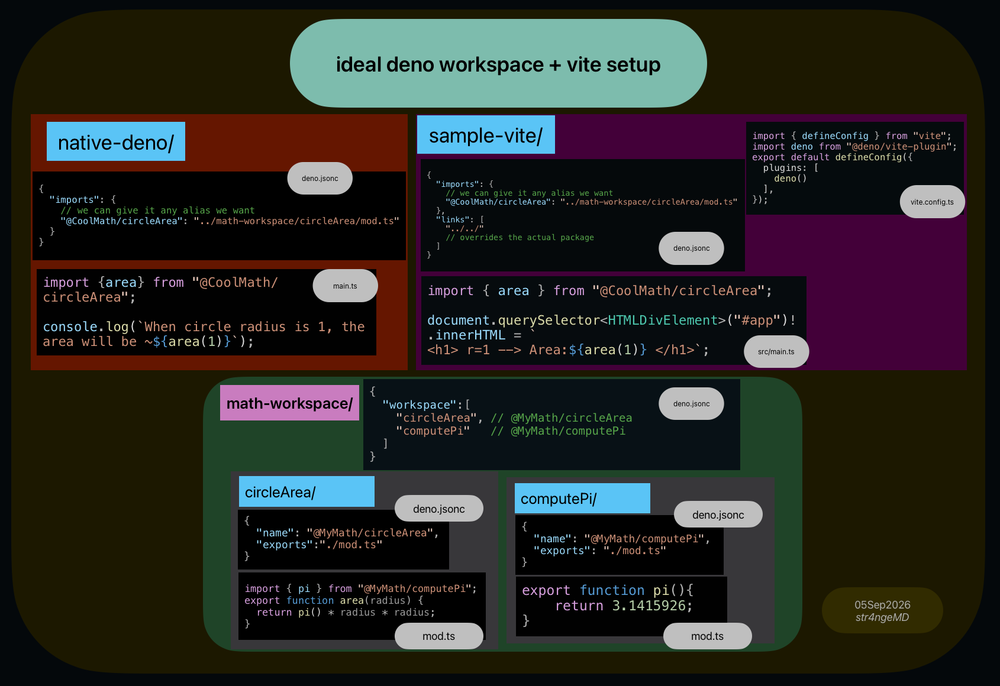

# Problem:

Deno *can* resolve a local workspace, from an outside-workspace project.

I expected `@deno/vite-plugin` to be able to do that. It can't.

See EXAMPLE/readme.md for 
- minimal reproduction
- how deno works as intended
- how vite plugin fails
- and how it is solved

See src/index.ts, prefixPlugin.ts and resolvePlugin.ts files for the change.

This readme and everything inside EXAMPLE is written by me, human. 

However the actual **plugin code in 3 ts files were written by AI. Beware!**

Thank you for checking this out.

Also I put this to JSR for my convenience, (until the original repo gains this feature).

```
deno add jsr:@str4ngemd/deno-vite-plugin@2.0.3-1 
```


---
## Deno vite plugin

Plugin to enable Deno resolution inside [vite](https://github.com/vitejs/vite).
It supports:

- Alias mappings in `deno.json`
- `npm:` specifier
- `jsr:` specifier
- `http:` and `https:` specifiers

## Limitations

Deno specific resolution cannot be used in `vite.config.ts` because it's not
possible to intercept the bundling process of the config file in vite.

## Usage

Install this package:

```sh
# npm
npm install @deno/vite-plugin
# pnpm
pnpm install @deno/vite-plugin
# deno
deno install npm:@deno/vite-plugin
```

Add the plugin to your vite configuration file `vite.config.ts`:

```diff
  import { defineConfig } from "vite";
+ import deno from "@deno/vite-plugin";

  export default defineConfig({
+   plugins: [deno()],
  });
```

## License

MIT, see [the license file](./LICENSE).
